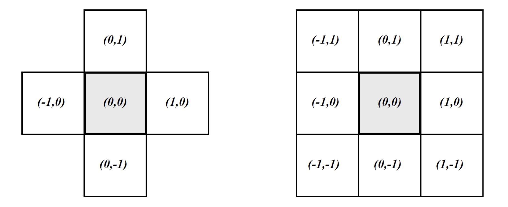

# Cellular Automata

This repository provides general library of tools to build, run, and analyze cellular automata simulations. 

## What is Cellular Automata (CA)?

__Cellular automata__ refers to a class of simulations based on a system of cells that maintain state and change state over time based on environment variables, influences from neighbhoring cells and a cells previous state. The system of cells forms an N-dimensional grid where for each time step a simultaneous update is applied to each cell of the grid using what is called a __state transition function__. A state transition function takes into consideration a cells __neighborhood__ and a __rule__ for how update a cells state. A neighborhood simply refers to the adjcent cells which should be considered when applying a rule to update a cells state. Two common neighborhood definitions are the __VonNeumann__ and __Moore neighborhood__ pictured below, left and right respectively.

The rule applied to each cell in a state transition function contains the domain specific knowledge of how a cells state should be updated given the states of the cells in its neighborhood. For example, one common rule is the __majority rule__ which is a rule where a cell will change its state to the mode of its neighboring cell states.

CA provide a powerful tool for modeling complex systems because it allows the modeling of nonlinear spatio-temporal dynamics as well as the ability to solve problemsn in a non linear interactions between neighbors cells as well as the ability to 

### Depdencies

- C++11
- Makefile

### Examples

## Repository Struture

This repository is structure using a standard Makefile structure.

- Root directory: cellular-automata-molecular-dynamics
	- Subdirectories:
		- README.md: this file, documentation on library functionality and a conceptual introduction to cellular automata
		- Makefile: makefile to generate all executables and libraries also commands clean all the subdirectories. See Makefile for possible 'make commands'.
		- src: this directory contains the source code with the functionality.
		- include: this directory contains the APIs in the form of .h include files
		- lib: object file produced from making the src direcotry
		- tests: this directory contains test programs used to test the functionalities of the Cellular Atomaton.
		- bin: this directory contains all the executable program

### Collaborators
- Kevin Fong
- Xavier Linn
- Xiange Wang
